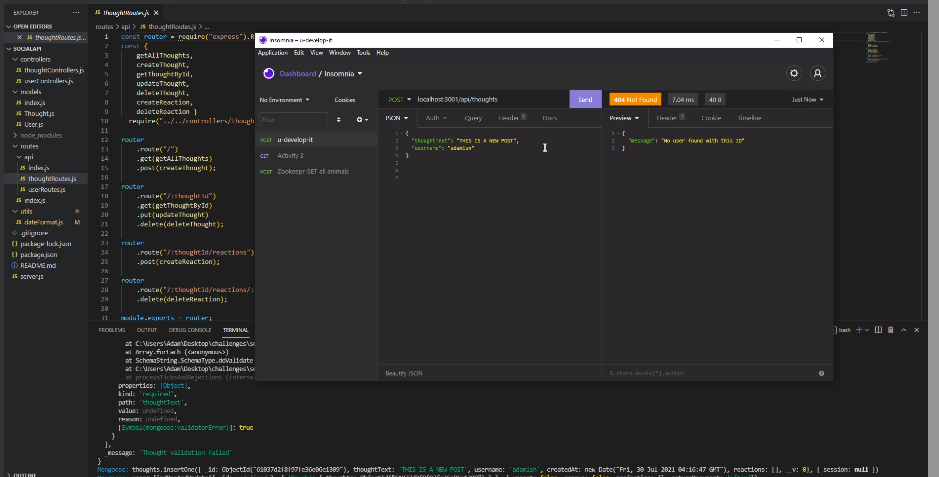

  

  ## Description
  
  A NoSQL backend for a hypothetical social network API

  ## Table of Contents
  
  * [Installation](#installation)
  * [Usage](#usage)
  * [Contributing](#contributing)
  * [Tests](#tests)
  * [Questions](#questions)
  
  ## Installation
  
  This program utilizes node applications, primarily mongoose

  ## Usage
  
  This demonstrates ability to host a backend API to create and modify datasets without SQL. Mongo, through mongoose, allows such with some ease.

  ## Contributing
  
  No contributors at this time.

  ## Tests
  
  No collaborators at this time.

  ## Questions
  
  Reach out to me at the links below with any questions, comments, or concerns:

  GitHub: [adamlsn](https://github.com/adamlsn) 
  email: [adamlsn@gmail.com](mailto:adamlsn@gmail.com)
  
